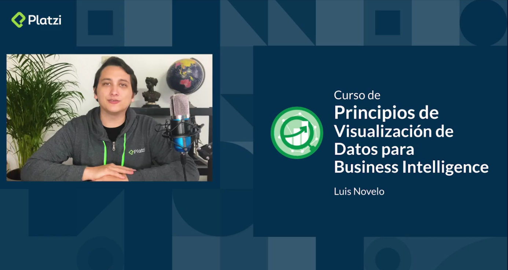

<h1 align=center>Hi there 👋! I'm Luis Novelo  Welcome to my profile, thanks for passing by😃</h1>
 

&nbsp;&nbsp;&nbsp;&nbsp;
  &nbsp;&nbsp;&nbsp;
  &nbsp;
  &nbsp;&nbsp;&nbsp;&nbsp;
  &nbsp;&nbsp;&nbsp;&nbsp;
   &nbsp;&nbsp;&nbsp;&nbsp;

## A little bit about me... 
 
I am a person who likes to work as a leader on a team, always looking for new solutions thinking out of the box.  Finance and Data Analysis are my passions. 📈📊
 
 
<b>Want to talk about technologies, finances or Data Science? </b> Don't hesitate in reaching me via   mail:
 <a href="mailto:novelo.novelo1992@gmail.com">novelo.novelo1992@gmail.com </a>or <a href="https://www.linkedin.com/in/novelo-luis/">Linkedin </a>
  
 

## Work 🤓
Currently working as an Academic Coach and Professor in <a href="https://platzi.com/profesores/novelonovelo/">Platzi </a> on several topics such as   
 <li> <a href="https://platzi.com/cursos/visualizacion-datos/">Data visualization principles </a></li>
 <li><a href="https://platzi.com/cursos/tableau/"> Storytelling with Tableau</a></li>
 <li> <a href="https://platzi.com/cursos/business-intelligence/">Business Intelligence</a></li> 
 

***

## Projects 🚀
I really like doing personal projects related to data analysis and interpretation. I preffer using Tableau Public as my main data visualization tool but I also have worked with Python using Jupyter Notebooks  
Some of my projects: 
<li> <a href="https://github.com/PhinanceScientist/k-means_economic-vulnerability">Merida's Neighborhoods clustered by economic vulnerability due to COVID 19 outbreak</a></li>
<li> <a href="https://public.tableau.com/app/profile/luis.novelo6593/viz/CapStone_15970406892880/MexicoViolence">Violence in México</a></li>
<li> <a href="https://github.com/PhinanceScientist/AMLO_Wordcloud">Mexico's President speech wordcloud</a></li> 

***

##  GEEK GODIN 📺

In my spare time I like making content for my Youtube channel <a href="https://www.youtube.com/channel/UCGHj9f_nZd7tBEf9BOJ4aXA">GEEK GODIN</a> where I analyze real life cases for Business Intelligence and also teach tech concepts to non tech people. As a businessman who happens to have learned Python, I really like sharing the benefits of knowing basic concepts related to programming and data science. 
## Latest videos
<!-- BLOG-POST-LIST:START -->
- [GEEK GODIN](https://www.youtube.com/watch?v=qnAWCb2SXTw)
- [Business Intelligence con Tableau: Caso del metro de CDMX](https://www.youtube.com/watch?v=eTEvfF5TBxE)
- [Business Intelligence - Inteligencia de Negocios: Todo lo que debes saber](https://www.youtube.com/watch?v=qBTM9B2Nb0E)
<!-- BLOG-POST-LIST:END -->

***

## GitHub Stats
 

<a href="https://github.com/phinancescientist">
  

 
 
 

<!--
**PhinanceScientist/PhinanceScientist** is a ✨ _special_ ✨ repository because its `README.md` (this file) appears on your GitHub profile.

Here are some ideas to get you started:

- 🔭 I’m currently working on ...
- 🌱 I’m currently learning ...
- 👯 I’m looking to collaborate on ...
- 🤔 I’m looking for help with ...
- 💬 Ask me about ...
- 📫 How to reach me: ...
- 😄 Pronouns: ...
- ⚡ Fun fact: ...
-->
